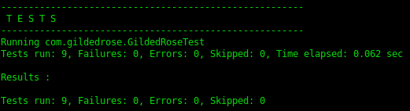
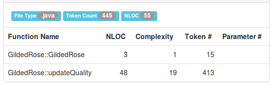
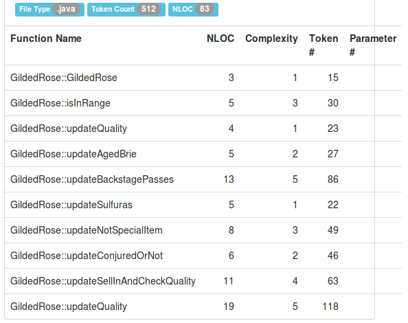

GildedRose
==========

Wstępny opis...

(1) Testy
---------

Przeprowadzono 9 testów jednostkowych (JUnit).

Wszystkie testy przechodzą pomyślnie.

(2) Złożoność
-------------

Wstępnie mamy dwie metody, z których jedna ma złożoność 19.
Trochę dużo.

Jednak po małej refaktoryzacji...

Najbardziej złożone metody mają złożoność 5. Jest to już
wartość bezpieczna.

(3) Kod
-------

...

(4) Refaktoryzacja
------------------

...
