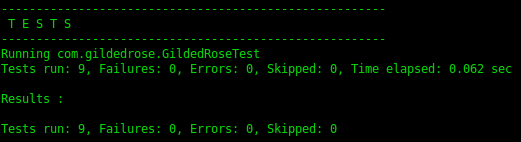
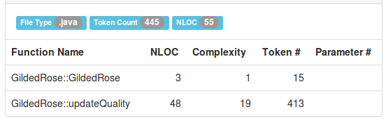
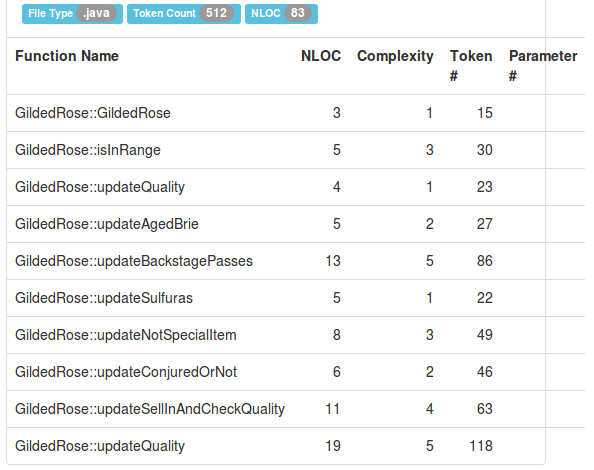

GildedRose
==========

*Słowem wstępu...*

Przykładowe rozwiązanie przypadku GildedRose. Używanym obiektowym językiem
programowania jest Java.

(1) Testy
---------

Przeprowadzono 9 testów jednostkowych (JUnit), z których każdy odpowiedzialny
jest za sprawdzenie zgodności aplikacji z opisem i jej potwierdzenie lub
zaprzeczenie z zaznaczeniem miejsca, w którym błąd występuje.

Póki co, wszystkie przeprowadzone testy przechodzą pomyślnie, co na tym etapie
jest efektem porządanym i satysfakcjonującym.

(2) Złożoność
-------------

Wstępnie mamy dwie metody, z których jedna ma złożoność 19. Trochę dużo,
zważywszy na fakt, że jest to górna granica umiarkowanego ryzyka w skali
złożoności cyklomatycznej - dwa punkty więcej i ryzyko byłoby już wysokie.

Jednak po małej refaktoryzacji, zgodnej z *pewnymi* regułami...

Najbardziej złożone metody mają złożoność 5. Jest to już wartość bezpieczna,
gdyż w skali złożoności cyklomatycznej nie stanowi dużego ryzyka.

(3) Kod
-------

Kod źródłowy przed refaktoryzacją (metoda _updateQuality_):
[source,java]
-----------------
public void updateQuality() {
  for (int i = 0; i < items.length; i++) {
    if (!items[i].name.equals("Aged Brie")
        && !items[i].name.equals("Backstage passes to a TAFKAL80ETC concert")) {
          if (items[i].quality > 0) {
            if (!items[i].name.equals("Sulfuras, Hand of Ragnaros")) {
              items[i].quality = items[i].quality - 1;
            }
          }
    } else {
      if (items[i].quality < 50) {
        items[i].quality = items[i].quality + 1;

        if (items[i].name.equals("Backstage passes to a TAFKAL80ETC concert")) {
          if (items[i].sellIn < 11) {
            if (items[i].quality < 50) {
              items[i].quality = items[i].quality + 1;
            }
          }

          if (items[i].sellIn < 6) {
            if (items[i].quality < 50) {
              items[i].quality = items[i].quality + 1;
            }
          }
        }
      }
    }

    if (!items[i].name.equals("Sulfuras, Hand of Ragnaros")) {
      items[i].sellIn = items[i].sellIn - 1;
    }

    if (items[i].sellIn < 0) {
      if (!items[i].name.equals("Aged Brie")) {
        if (!items[i].name.equals("Backstage passes to a TAFKAL80ETC concert")) {
          if (items[i].quality > 0) {
            if (!items[i].name.equals("Sulfuras, Hand of Ragnaros")) {
              items[i].quality = items[i].quality - 1;
            }
          }
        } else {
          items[i].quality = items[i].quality - items[i].quality;
        }
      } else {
        if (items[i].quality < 50) {
          items[i].quality = items[i].quality + 1;
        }
      }
    }
  }
}
-----------------

Sporo tu chaosu, zamieszania i braku konsekwencji. Kod jest mało intuicyjny
na pierwszy rzut oka. Pełno zagnieżdżonych _if-else_ zależnych od siebie
w mniejszym lub większym stopniu.

Kod źródłowy po refaktoryzacji (metoda _updateQuality_ i wszystkie inne, które
zostały z niej wyodrębnione):
[source,java]
-----------------
public Boolean isInRange(int value, int min, int max)
{
  if (value > min && value < max) return true;
  else return false;
}

public Item updateQuality(Item item, int by) {
  item.quality = item.quality + by;
  return item;
}

public Item updateAgedBrie(Item item) {
  if (item.quality < 50)
    item = updateQuality(item, 1);
    return item;
}

public Item updateBackstagePasses(Item item) {
  if (item.quality < 50)
  {
    if (isInRange(item.sellIn, 5, 11)) {
      item = updateQuality(item, 2);
    } else if (isInRange(item.sellIn, 0, 6)) {
      item = updateQuality(item, 3);
    } else if (item.sellIn == 0) {
      item.quality = 0;
    }
  }
  return item;
}

public Item updateSulfuras(Item item) {
  item.sellIn = 0;
  item.quality = 80;
  return item;
}

public Item updateNotSpecialItem(Item item) {
  if (item.quality > 0) {
    int multiplier = 1;
    if (item.name.contains("Conjured")) multiplier = 2;
    item = updateConjuredOrNot(item, multiplier);
  }
  return item;
}

public Item updateConjuredOrNot(Item item, int multiplier)
{
  if (item.sellIn > 0) item = updateQuality(item, -1 * multiplier);
  else item = updateQuality(item, -2 * multiplier);
  return item;
}

public Item updateSellInAndCheckQuality(Item item)
{
  if (!item.name.equals("Sulfuras, Hand of Ragnaros")) {
    item.sellIn = item.sellIn - 1;
    if (item.quality < 0)
      item.quality = 0;
    else if (item.quality > 50)
      item.quality = 50;
  }
  return item;
}

public void updateQuality() {
  for (int i = 0; i < items.length; i++) {
    switch (items[i].name) {
      case "Aged Brie":
        items[i] = updateAgedBrie(items[i]);
        break;
      case "Backstage passes to a TAFKAL80ETC concert":
        items[i] = updateBackstagePasses(items[i]);
        break;
      case "Sulfuras, Hand of Ragnaros":
        items[i] = updateSulfuras(items[i]);
        break;
      default:
        items[i] = updateNotSpecialItem(items[i]);
        break;
      }
    items[i] = updateSellInAndCheckQuality(items[i]);
  }
}
-----------------

Krótko, zwięźle i na temat. Wszystko wyodrębnione do mniejszych metod,
uporządkowane i łatwiejsze do zrozumienia na pierwszy rzut oka.

(4) Refaktoryzacja
------------------

Etapy refaktoryzacji:

1. Zapoznanie się z kodem źródłowym aplikacji i mechanizmami weń zawartymi.
Szczególne zwrócenie uwagi na strukturę metod i sposób przetwarzania danych.

2. Zbadanie jakości kodu jakąś metryką, np. złożoność cyklomatyczna,
porównanie wyniku z odpowiednią skalą i wyciągnięcie wniosków.

3. Napisanie testów zgodnych z listą wymagań, których oczekujemy, aby
program spełniał.

4. W przypadku niepowodzenia któregoś z testów - wprowadzić odpowiedni
zmiany w kodzie i powtórzyć krok. W przypadku powodzenia przejść do kroku
następnego.

5. Przeprowadzenie odpowiednich modyfikacji w kodzie nie zmieniając jego
zachowania, jednak trzymając się *pewnych* reguł.

6. Ponowne zbadanie jakości kodu (powtórzenie kroku 2.), porównanie
czy jest lepiej i wyciągnięcie wniosków.

7. Sprawdzenie, czy wszystko działa zgodnie z pierwotnymi założeniami.
Jeśli tak - zadanie wykonane. Jeśli nie - powtórzyć proces.
