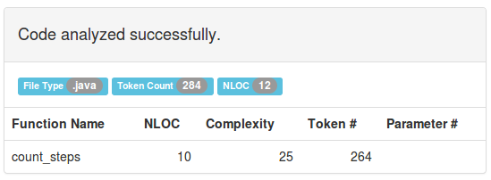
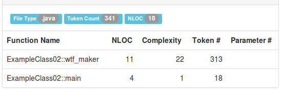

Zaawansowane języki programowania
---------------------------------

*Student:* Mariusz Mazepa

*Środowisko pracy*

[options="header"]
|===============================================================================================
| System operacyjny | Powłoka | Hostingowy serwis (Git) | Edytor | Obiektowy język programowania
| Linux Xubuntu     | Bash    | GitHub                  | Atom   | Java
|===============================================================================================

*Narzędzia dla języka Java*

[options="header"]
|====================================================================================================================================================================
| Narzędzie                                      | Opis
| http://checkstyle.sourceforge.net/[checkstyle] | Checking Java source code for adherence to a Code Standard or set of validation rules (best practices).
| https://www.spinellis.gr/sw/ckjm/[ckjm]        | Calculates Chidamber and Kemerer object-oriented metrics by processing the bytecode of compiled Java files.
| https://www.sonarsource.com/[Sonar]            | SonarSource delivers what is probably the best static code analyzer you can find on the market for Java.
| http://www.lizard.ws/[Lizard]                  | Analyzing the complexity of source code right away supporting many programming languages, without any extra setup.
|====================================================================================================================================================================

Przydatne linki
---------------

* https://github.com/mre/awesome-static-analysis
* https://sonarcloud.io
* https://pmd.github.io/
* https://pl.wikipedia.org/wiki/Metryka_oprogramowania#Zestaw_metryk_CK

Złożoność cyklomatyczna
-----------------------

*Złożoność cyklomatyczna* – metryka oprogramowania opracowana przez
Thomasa J. McCabe'a w 1976, używana do pomiaru stopnia skomplikowania
programu. Podstawą do wyliczeń jest liczba dróg w schemacie blokowym
danego programu, co oznacza wprost liczbę punktów decyzyjnych w tym
programie. Ponadto są uwzględniane tzw. skojarzenia odśrodkowe
(ang. efferent couplings) oraz dośrodkowe (ang. afferent couplings).
W rezultacie wyznaczana jest niestabilność.

*Przykład nr 1:* dużo konstrukcji if-else

.ExampleClass01.java
[source,java]
-----------------
class ExampleClass01
{
  public static int wtf_maker(int a, int b, int c)
  {
    if (a >= 0 && b >= 0 && c >= 0)
    {
      if (a == 0 && b == 0 && c == 0) return 0;
      else wtf_maker(a-1, b-1, c-1);
    }
    else if (a >= 0 && b >= 0 && c < 0) wtf_maker(a-1, b-1, c+1);
    else if (a >= 0 && b < 0 && c >= 0) wtf_maker(a-1, b+1, c-1);
    else if (a >= 0 && b < 0 && c < 0) wtf_maker(a-1, b+1, c+1);
    else if (a < 0 && b >= 0 && c >= 0) wtf_maker(a+1, b-1, c-1);
    else if (a < 0 && b >= 0 && c < 0) wtf_maker(a+1, b-1, c+1);
    else if (a < 0 && b < 0 && c >= 0) wtf_maker(a+1, b+1, c-1);
    else if (a < 0 && b < 0 && c < 0) wtf_maker(a+1, b+1, c+1);
    else if (a == 0 && b == 0 && c == 0) return 0;
    return 0;
  }

  public static void main (String[] args)
  {
    wtf_maker(10, 20, 30);
  }
}
-----------------

*Przykład nr 2:* zagnieżdżanie konstrukcji if-else

.ExampleClass02.java
[source,java]
-----------------
class ExampleClass02
{
  public static int wtf_maker(int a, int b, int c)
  {
    if (a > 0) { if (b > 0) wtf_maker(a-1,b-1,c); if (c > 0) wtf_maker(a-1,b,c-1); }
    else if (b > 0) { if (a > 0) wtf_maker(a-1,b-1,c); if (c > 0) wtf_maker(a,b-1,c-1); }
    else if (c > 0) { if (a > 0) wtf_maker(a-1,b,c-1); if (b > 0) wtf_maker(a,b-1,c-1); }

    if (a < 0) { if (b < 0) wtf_maker(a+1,b+1,c); if (c < 0) wtf_maker(a+1,b,c+1); }
    else if (b < 0) { if (a < 0) wtf_maker(a+1,b+1,c); if (c < 0) wtf_maker(a,b+1,c+1); }
    else if (c < 0) { if (a < 0) wtf_maker(a+1,b,c+1); if (b < 0) wtf_maker(a,b+1,c+1); }

    if (a == 0 && b == 0 && c == 0) return 0;
    return 0;
  }

  public static void main (String[] args)
  {
    wtf_maker(10, 20, 30);
  }
}
-----------------

Przytaczane są poniższe wartości złożoności cyklomatycznej:

* *od 1 do 10* – kod dość prosty stwarzający nieznaczne ryzyko,
* *od 11 do 20* – kod złożony powodujący ryzyko na średnim poziomie,
* *od 21 do 50* – kod bardzo złożony związany z wysokim ryzykiem,
* *powyżej 50* – kod niestabilny grożący bardzo wysokim poziomem ryzyka.
