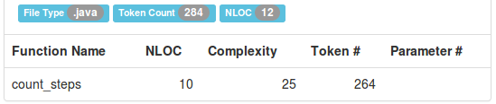
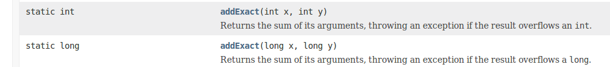
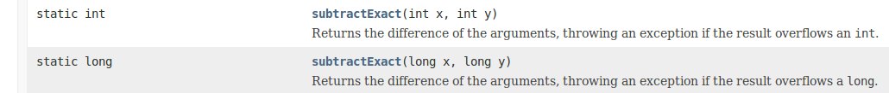
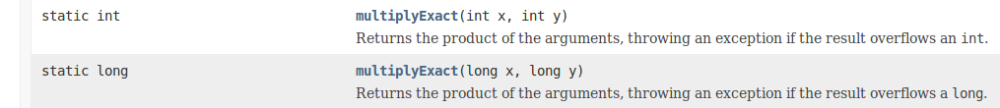

Zaawansowane języki programowania
---------------------------------

*Student:* Mariusz Mazepa

*Środowisko pracy*

[options="header"]
|===============================================================================================
| System operacyjny | Powłoka | Hostingowy serwis (Git) | Edytor | Obiektowy język programowania
| Linux Xubuntu     | Bash    | GitHub                  | Atom   | Java
|===============================================================================================

*Narzędzia dla języka Java*

[options="header"]
|====================================================================================================================================================================
| Narzędzie                                      | Opis
| http://checkstyle.sourceforge.net/[checkstyle] | Checking Java source code for adherence to a Code Standard or set of validation rules (best practices).
| https://www.spinellis.gr/sw/ckjm/[ckjm]        | Calculates Chidamber and Kemerer object-oriented metrics by processing the bytecode of compiled Java files.
| https://www.sonarsource.com/[Sonar]            | SonarSource delivers what is probably the best static code analyzer you can find on the market for Java.
| http://www.lizard.ws/[Lizard]                  | Analyzing the complexity of source code right away supporting many programming languages, without any extra setup.
|====================================================================================================================================================================

Przydatne linki
---------------

* https://github.com/mre/awesome-static-analysis[Awesome Static Analysis]
* https://sonarcloud.io[SonarCloud]
* https://pmd.github.io/[PMD on GitHub]
* https://pl.wikipedia.org/wiki/Metryka_oprogramowania#Zestaw_metryk_CK[Zestaw metryk CK (Wikipedia)]

Złożoność cyklomatyczna
-----------------------

*Złożoność cyklomatyczna* – metryka oprogramowania opracowana przez
Thomasa J. McCabe'a w 1976, używana do pomiaru stopnia skomplikowania
programu. Podstawą do wyliczeń jest liczba dróg w schemacie blokowym
danego programu, co oznacza wprost liczbę punktów decyzyjnych w tym
programie. Ponadto są uwzględniane tzw. skojarzenia odśrodkowe
(ang. efferent couplings) oraz dośrodkowe (ang. afferent couplings).
W rezultacie wyznaczana jest niestabilność.

*Przykład:*

Metoda zliczająca ilość potrzebnych kroków, aby wrócić do punktu (0,0,0).
Przykładowe wykorzystanie: gra wykorzystująca układ współrzędnych. Przykładowe
wywołanie: count_steps(10,20,15) - metoda zwraca ilość kroków z (10,20,15)
do (0,0,0) najkrótszą drogą.

.ExampleClass01.java
[source,java]
-----------------
int steps = 0;
public static int count_steps(int x, int y, int z) {                           // 1=1(metoda)
  if (x > 0 && y > 0 && z > 0) { steps += 3; count_steps(x-1, y-1, z-1); }     // 3=1(if)+1(&&)+1(&&)
  else if (x > 0 && y > 0 && z == 0) { steps += 2; count_steps(x-1, y-1, z); } // 3=1(if)+1(&&)+1(&&)
  else if (x > 0 && y == 0 && z > 0) { steps += 2; count_steps(x-1, y, z-1); } // 3=1(if)+1(&&)+1(&&)
  else if (x > 0 && y == 0 && z == 0) { steps += 1; count_steps(x-1, y, z); }  // 3=1(if)+1(&&)+1(&&)
  else if (x == 0 && y > 0 && z > 0) { steps += 2; count_steps(x, y-1, z-1); } // 3=1(if)+1(&&)+1(&&)
  else if (x == 0 && y > 0 && z == 0) { steps += 1; count_steps(x, y-1, z); }  // 3=1(if)+1(&&)+1(&&)
  else if (x == 0 && y == 0 && z > 0) { steps +=1;  count_steps(x, y, z-1); }  // 3=1(if)+1(&&)+1(&&)
  else if (x == 0 && y == 0 && z == 0) return steps;                           // 3=1(if)+1(&&)+1(&&)
}                                                                              // razem: 25
int steps = count_steps(10,20,15);
-----------------

Przytaczane są poniższe wartości złożoności cyklomatycznej (McCabe Cyclomatic Complexity - MCC):

|=====================================================================================
| *MCC*       | 1-10          | 11-20         | 21-50     | 51+
| *Assesment* | not much risk | moderate risk | high risk | untestable, very high risk
|=====================================================================================

Czym jest _true_ w Javie?
-------------------------

Przykładowe wywołania konkretnych linijek kodu.

[source,java]
-----------------
System.out.println(true.getClass());                      // error: boolean cannot be dereferenced
System.out.println(new Boolean(true).getClass());         // class java.lang.Boolean
System.out.println(new Boolean(true) instanceof Boolean); // true
System.out.println(0==0);                                 // true
System.out.println((0==0).getClass());                    // error: boolean cannot be dereferenced
-----------------

**Typy proste ("prymitywne") w Javie**

Jednym z nich jest typ boolowski, którego zmienne można
ustawić tylko na true lub false.

**_true_, _false_ i _null_**

_true_, _false_ i _null_ mogą wydawać się słowami kluczowymi, ale w
rzeczywistości są literałami; nie można ich używać jako identyfikatorów
w swoich programach.

Czy w Javie istnieje coś w stylu _5.add(2)_?
--------------------------------------------

Niestety w języku Java liczby (jako typy proste) nie posiadają własnych
metod. Niemożliwym jest więc wywołanie metody _add_ od cyfry 5 z parametrem 2
aby uzyskać 7, gdyż same zmienne jako takie nie mają w sobie żadnych metod
wspierających działania arytmetyczne.

**Typy obiektowe w Javie**

Cechą charakterystyczną dla Javy jest to, że występują w niej „opakowania”
(wrappers) na typy proste czyniąc z nich typy obiektowe. Oto lista
niektórych typów obiektowych opakowujących typy proste:

* Byte,
* Integer,
* Float,
* Double.

Wszystkie one rozszerzają abstrakcyjną klasę _Number_, a te wspomniane również
opakowują odpowiadające im z nazwy typy proste.

Dokumentacja Javy w wersji 8 ostrzega, że konwersja z typu obiektowego
na prosty może spowodować utratę pewnych informacji, zmniejszenie precyzji
czy nawet zmianę znaku.

Typy obiektowe mają też swoje pola i metody, które dość często
okazują się przydatne. Są wśród nich chociażby pola MIN_VALUE, MAX_VALUE
czy SIZE (nazwy mówią same za siebie co one przechowują) oraz
cały szereg metod służących do rzutowania, szczególnie metoda toString().
**Niestety nie ma wśród nich metod takich jak _add_, _inc_ czy _dec_ pozwalających
na bezpośrednie wywoływanie metod inkrementacji czy dekrementacji z poziomu
liczby jako takiej.** Podobnież jak w typach prostych - same zmienne nie mają
w sobie żadnych metod wspierających działania arytmetyczne.

**Arytmetyka w Javie**

Poza najbardziej oczywistymi operatorami arytmetycznymi (takimi jak
_+_, _-_, _*_, _/_) w Javie istnieją metody umożliwiające ich zastąpienie,
jednak - jak zostało to wspomniane powyżej - niemożliwe do bezpośredniego
wywołania od liczbowej wartości zmiennej. Zawierają się w klasie _Math_
i można je wykorzystać wedle zapisu w dokumentacji. Przykładowo:

**addExact** (dodawanie, operator "_+_")

**subtractExact** (odejmowanie, operator "_-_")

**multiplyExact** (mnożenie, operator "_*_")

Powyższe grafiki są przyciętymi zrzutami ekranu z dokumentacji klasy _Math_.
Aby przejść do wspomnianej dokumentacji
https://docs.oracle.com/javase/8/docs/api/java/lang/Math.html[kliknij tutaj].
